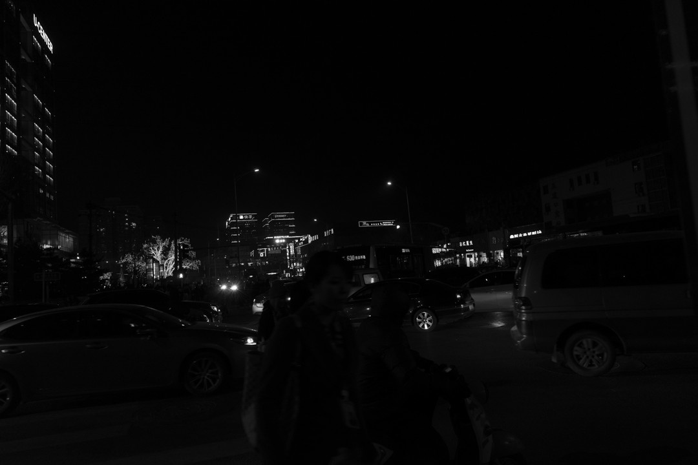
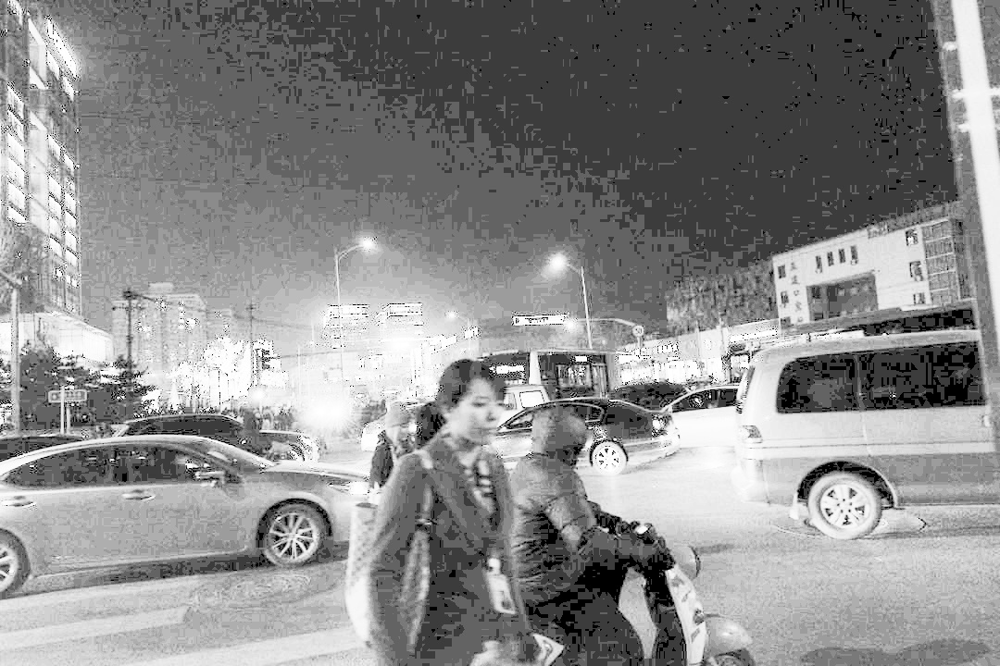
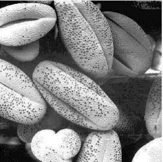

# CVL Assignment 01 - Histogram Equalization

## Deskripsi

Penggunaan **histogram equalization** pada gambar yang gelap dan terang untuk meningkatkan kontras dan memperjelas detail gambar. 
Histogram equalization adalah teknik yang menyebarkan distribusi intensitas piksel lebih merata.

## Cara Kerja

1. Program membaca gambar grayscale dari file.
2. Histogram intensitas piksel dihitung.
3. Melakukan Cumulative Distribution Function (CDF) dari histogram.
4. Setiap nilai piksel pada gambar asli dipetakan ke nilai baru berdasarkan CDF.
5. Gambar hasil equalization disimpan dan ditampilkan.

## Link Google Colab
https://colab.research.google.com/drive/1edT3vuK5gqKdGVXIFrX8xg6LaERBS-G1?usp=sharing 

## Report
Detail Laporan dapat dilihat di
[Histogram Equalization Report](Histogram_Equalization_Report.pdf)

## Perbandingan Gambar

| Sebelum (Original)                | Sesudah (Enhanced)                |
|------------------------------------|-----------------------------------|
|   |  |
|   |  |

- **Gambar Sebelum:** Gambar asli terlalu gelap atau terang dan detail kurang jelas.
- **Gambar Sesudah:** Setelah histogram equalization, gambar menjadi lebih terang atau gelap dan detail lebih jelas.

