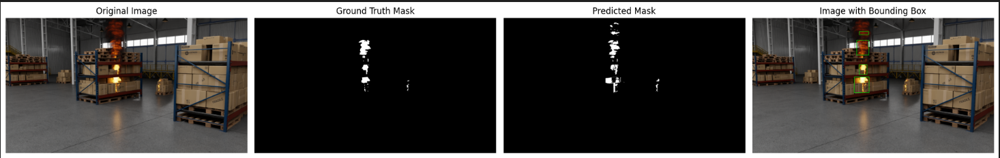

# Fire Detection with Probabilistic Thresholding

Implementasi deteksi api berbasis **pendekatan probabilitas** mengikuti metode dari  
**Liew et al. (2006) – “Deriving Optimal Thresholds for Active Fire Detection” (IEEE IGARSS).**  
Paper: https://doi.org/10.1109/IGARSS.2006.844

---

## Deskripsi
- Sistem ini mendeteksi piksel api dengan menghitung nilai fitur  
  $P_{\text{fire}} = (1 - H_{\text{norm}}) \times S_{\text{norm}} \times V_{\text{norm}}$

- Dua distribusi probabilitas (PDF) dipelajari dari data:
  - **P(x | Fire)** dan **P(x | Background)**  
- Ambang optimal ditentukan di titik potong kedua PDF (*Maximum Likelihood Criterion*).  
- Dataset yang digunakan diambil dari: **SYN-FIRE: Synthetic Dataset for Fire Detection in Indoor Environments**  
  (Figshare) — https://doi.org/10.6084/m9.figshare.26233454.v1

---

## Alur Program
1. **Estimasi PDF** piksel api & latar belakang (`estimate_fire_background_pdfs`)  
2. **Hitung ambang optimal** (`derive_optimal_threshold`)  
3. **Deteksi api** pada citra baru (`fire_probability_mask`)  
4. **Evaluasi hasil** dengan IoU & akurasi  
5. **Visualisasi**: PDF, Error vs Threshold, Histogram P_fire, dan hasil deteksi  

---

## Report
Detail Laporan dapat dilihat di
[Fire Detection Report](Deteksi_Api_Report.pdf)

---

## Cara Menjalankan
```bash
pip install numpy opencv-python matplotlib scipy
python cvl_assignment02.py
```

Folder `dataset/` harus berisi citra dan mask biner (`*_mask.png`).

---

## Output Utama
- **Ambang optimal** (contoh): 0.31  
- **Rata-rata IoU**: ~0.40  
- **Rata-rata Akurasi**: ~0.99  
- Plot PDF, histogram, dan hasil deteksi otomatis ditampilkan.

Contoh Hasil untuk dataset 17
 
